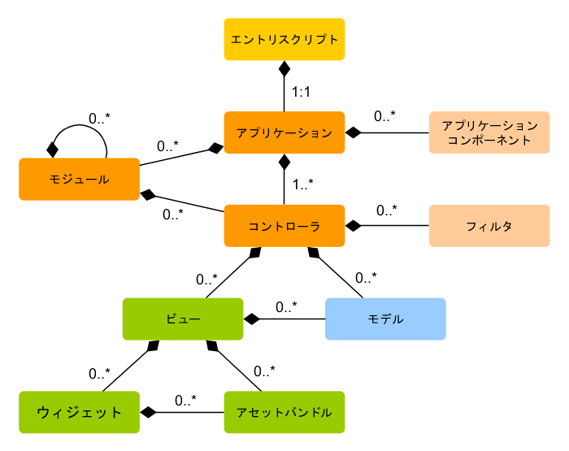
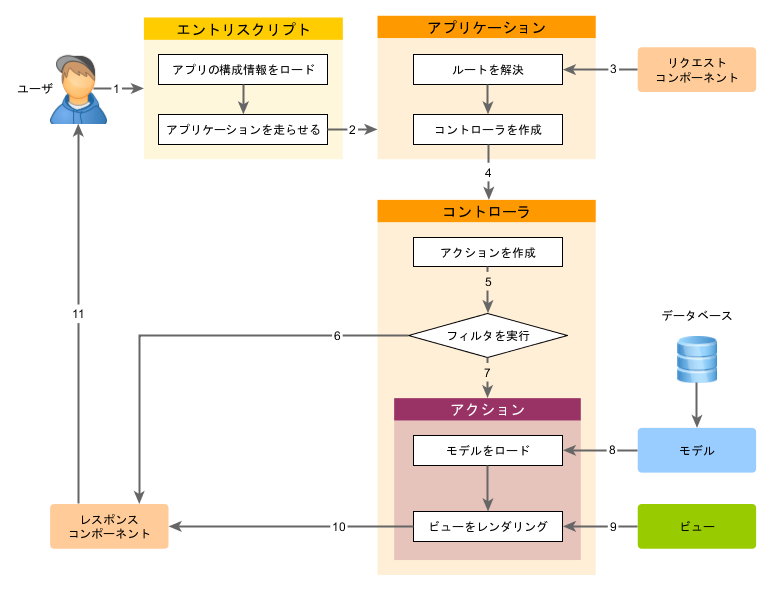

アプリケーションを走らせる
==========================

Yii のインストールが終ると、実際に動く Yii のアプリケーションにアクセスすることが出来るようになります。
その URL は、`http://hostname/basic/web/index.php` あるいは `http://hostname/index.php` など、設定によって異なります。
この節では、アプリケーションに組み込み済みの機能を紹介し、コードがどのように組織されているか、そして、一般にアプリケーションがリクエストをどのように処理するかを説明します。

> Info|情報: 話を簡単にするために、この「始めよう」のチュートリアルを通じて、`basic/web` をウェブサーバのドキュメントルートとして設定したと仮定します。
  そして、アプリケーションにアクセスするための URL は `http://hostname/index.php` またはそれに似たものになるように設定したと仮定します。
  必要に応じて、説明の中の URL を読み替えてください。


機能<a name="functionality"></a>
----

インストールされた基本的なアプリケーションは四つのページを持っています。

* ホームページ: `http://hostname/index.php` の URL にアクセスすると表示されます。
* 「について」のページ。
* 「コンタクト」のページ: エンドユーザがメールであなたに連絡を取ることが出来るコンタクトフォームが表示されます。
* 「ログイン」ページ: エンドユーザを認証するためのログインフォームが表示されます。
  "admin/admin" でログインしてみてください。
  「ログイン」のメインメニュー項目が「ログアウト」に変ることに気付くでしょう。

これらのページは共通のヘッダとフッタを持っています。
ヘッダには、異なるページ間を行き来することを可能にするメインメニューバーがあります。

ブラウザのウィンドウの下部にツールバーがあることにも気がつくはずです。
これは Yii によって提供される便利な [デバッグツールバー](tool-debugger.md)
であり、ログメッセージ、レスポンスのステータス、データベースクエリの実行状況、その他、たくさんのデバッグ情報を記録・表示するものです。


アプリケーションの構造<a name="application-structure"></a>
----------------------

アプリケーションにとって最も重要なディレクトリとファイルは (アプリケーションのルートディレクトリが `basic` だと仮定すると) 以下の通りです。

```
basic/                  アプリケーションのベースパス
    composer.json       Composer によって使用される。パッケージ情報を記述
    config/             アプリケーションその他の構成情報を格納
        console.php     コンソールアプリケーションの構成情報
        web.php         ウェブアプリケーションの構成情報
    commands/           コンソールコマンドのクラスを格納
    controllers/        コントローラのクラスを格納
    models/             モデルのクラスを格納
    runtime/            実行時に Yii によって生成されるファイル (ログやキャッシュなど) を格納
    vendor/             インストールされた Composer パッケージ (Yii フレームワークそのものを含む) を格納
    views/              ビューファイルを格納
    web/                アプリケーションのウェブルート。ウェブからアクセス可能なファイルを格納
        assets/         Yii によって公開されるアセットファイル (javascript と CSS) を格納
        index.php       アプリケーションのエントリスクリプト (ブートストラップスクリプト)
    yii                 Yii コンソールコマンド実行スクリプト
```

一般に、アプリケーションのファイルは二種類に分けることが出来ます。すなわち、`basic/web` の下にあるファイルとその他のディレクトリの下にあるファイルです。
前者は HTTP で (すなわちブラウザで) 直接にアクセスすることが出来ますが、後者は直接のアクセスは出来ませんし、許可すべきでもありません。

Yii は [モデル・ビュー・コントローラ (MVC)](http://wikipedia.org/wiki/Model-view-controller) デザインパターンを実装していますが、それが上記のディレクトリ構成にも反映されています。
`models` ディレクトリが全ての [モデルクラス](structure-models.md) を格納し、`views` ディレクトリが全ての [ビュースクリプト](structure-views.md) を格納し、
`controllers` ディレクトリが全ての [コントローラクラス](structure-controllers.md) を格納します。

次の図がアプリケーションの静的な構造を示すものです。



各アプリケーションは一つのエントリスクリプト `web/index.php` を持ちます。これはアプリケーション中で唯一ウェブからアクセス可能な PHP スクリプトです。
エントリスクリプトは入力されたリクエストを受け取って、[アプリケーション](structure-applications.md) のインスタンスを作成します。
[アプリケーション](structure-applications.md) は [コンポーネント](concept-components.md) の助力を得てリクエストを解決し、リクエストを MVC に送付します。
[ウィジェット](structure-widgets.md) は、複雑で動的なユーザインタフェイス要素を構築するために、[ビュー](structure-views.md) の中で使われます。


リクエストのライフサイクル<a name="request-lifecycle"></a>
--------------------------

次の図は、アプリケーションがどのようにリクエストを処理するかを示すものです。



1. ユーザが [エントリスクリプト](structure-entry-scripts.md) `web/index.php` に対してリクエストを出します。
2. エントリスクリプトはアプリケーションの [構成情報](concept-configurations.md) を読み出して、
   リクエストを処理する [アプリケーション](structure-applications.md) のインスタンスを作成します。
3. アプリケーションは、[リクエスト](runtime-requests.md) アプリケーションコンポーネントの助力を得て、
   リクエストされた [ルート](runtime-routing.md) を解決します。
4. アプリケーションがリクエストを処理する [コントローラ](structure-controllers.md) のインスタンスを作成します。
5. コントローラが [アクション](structure-controllers.md) のインスタンスを作成し、アクションのためのフィルタを実行します。
6. 一つでもフィルタが失敗したときは、アクションはキャンセルされます。
7. すべてのフィルタを通ったとき、アクションが実行されます。
8. アクションはデータモデルを、おそらくはデータベースから、読み出します。
9. アクションはデータモデルをビューに提供して、ビューをレンダリングします。
10. レンダリング結果が [レスポンス](runtime-responses.md) アプリケーションコンポーネントに返されます。
11. レスポンスコンポーネントがレンダリング結果をユーザのブラウザに送信します。

